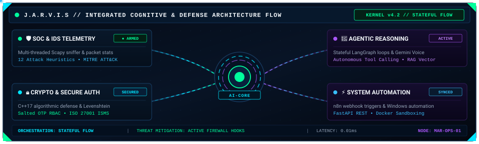
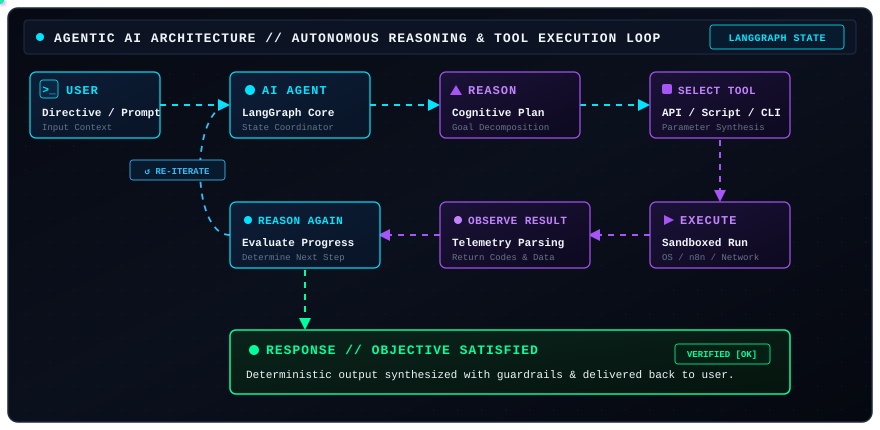

<div align="center">

<!-- HERO TERMINAL BOOT ANIMATION -->
<a href="#about-me">
  
</a>

<br/><br/>

# MUHAMMAD ABDULLAH RASHID
### `CYBERSECURITY × AGENTIC AI`

<p align="center">
  <b>Building intelligent systems that detect • analyze • automate • defend</b>
</p>

<p align="center">
  
  
  
  
</p>

<!-- JARVIS DIAGNOSTIC CONSOLE -->


</div>

<br/>

---

### `> ABOUT_ME`

<div align="left">

I am a **Cyber Security student** at **The University of Faisalabad (2024–2028)**, dedicated to the intersection of **network defense, threat detection, and autonomous Agentic AI**.

Rather than relying purely on passive theory or pre-packaged tools, I build practical software to understand how packets traverse the wire, how adversaries exploit vulnerabilities, and how intelligent agent loops can autonomously detect, analyze, and contain threats in real time.

```text
┌──[ SYSTEM_IDENTITY : OPERATOR_DOSSIER ]────────────────────────────────────────────────┐
│  • Identity   : Muhammad Abdullah Rashid                                               │
│  • Role       : Cybersecurity Student & Aspiring Security Researcher                   │
│  • Academics  : BS Cyber Security | The University of Faisalabad (2024–2028)           │
│  • Core Areas : SOC Monitoring • Intrusion Detection (IDS) • Agentic AI • Python      │
│  • Philosophy : Build systems to understand how they operate and how to defend them.   │
└────────────────────────────────────────────────────────────────────────────────────────┘
```

#### Primary Areas of Focus
* 🛡️ **SOC & Intrusion Detection (IDS)**: Designing telemetry ingestion pipelines, sniffing raw packets with Scapy, mapping heuristics to the MITRE ATT&CK framework, and building actionable security dashboards.
* 🤖 **Autonomous Agentic AI**: Architecting stateful cognitive execution loops using LangGraph, dynamic tool selection, RAG pipelines, and automated multi-step workflows.
* 🔒 **Secure Software Engineering**: Implementing multi-layered authentication (JWT, bcrypt), strict input validation, defensive REST APIs with Flask and FastAPI, and hardened execution sandboxes.
* ⚙️ **Systems & Networking**: Exploring deep protocol analysis (TCP/IP), network socket programming, Linux system internals, and containerized deployment.

</div>

<br/>

---

### `> AGENTIC_AI_ARCHITECTURE`

<div align="center">
  
</div>

#### Autonomous Execution Loop
My agentic AI systems are built on **goal-driven, tool-calling execution graphs** rather than isolated prompt-response chats:

1. **User Directive**: The user or telemetry feed initiates an objective with dynamic context.
2. **AI Agent State Coordinator**: Evaluates current system state and context in memory.
3. **Cognitive Reasoning**: Decomposes complex directives into structured, multi-step execution plans.
4. **Tool Selection**: Programmatically selects the optimal tool (custom Python script, REST API, shell utility, or vector store).
5. **Sandboxed Execution**: Executes the selected tool within protected execution boundaries.
6. **Observation & Telemetry**: Captures return codes, output data, and execution feedback.
7. **Re-Evaluation & Decision**: Inspects output to determine whether the objective is satisfied or requires another iterative reasoning cycle.
8. **Deterministic Response**: Returns the validated output with guardrails applied.

<br/>

---

### `> CYBERSECURITY_PIPELINE`

<div align="center">
  
</div>

#### Multi-Tier Defense Pipeline
Every security system is engineered around end-to-end telemetry and defense-in-depth:

* **01 // Ingress Traffic**: Monitors raw TCP, UDP, and ICMP network traffic across wire interfaces.
* **02 // Packet Sniffing**: Uses `Scapy` and raw sockets for promiscuous packet capture and header dissection.
* **03 // Protocol Analysis**: Extracts flow statistics, payload attributes, and communication patterns.
* **04 // Threat Detection**: Evaluates heuristics, abnormal traffic volume, port scan patterns, and known attacker signatures aligned with **MITRE ATT&CK**.
* **05 // Alert Dispatch**: Generates structured alert telemetry with severity scoring and timestamped incident metadata.
* **06 // SOC Response**: Visualizes incident telemetry on a web console, logs forensic records, and triggers automated containment.

<br/>

---

### `> FEATURED_PROJECTS`

<table width="100%">
  <tr>
    <td width="50%" valign="top">
      <h3>🛡️ Real-Time SOC Monitoring &amp; Attack Detection</h3>
      <p>
        A practical SOC/SIEM security platform engineered to monitor network activity, identify malicious anomalies, generate structured alerts, and provide visibility through an interactive dashboard.
      </p>
      <b>Architecture:</b>
      <pre><code>NETWORK ──▶ PACKET CAPTURE ──▶ DETECTION ENGINE ──▶ ALERT ──▶ SOC DASHBOARD</code></pre>
      <ul>
        <li><b>Network Telemetry:</b> Raw packet sniffing and protocol inspection via <code>Scapy</code>.</li>
        <li><b>Threat Classification:</b> Threshold heuristics aligned with <b>MITRE ATT&amp;CK</b> tactics.</li>
        <li><b>Host Telemetry:</b> CPU, memory, and process anomalies monitored via <code>psutil</code>.</li>
        <li><b>Access Control:</b> Hardened API routes secured with <code>JWT</code> tokens and <code>bcrypt</code> hashing.</li>
      </ul>
      <p>
        <b>Tech Stack:</b><br/>
        <code>Python</code> • <code>Flask</code> • <code>Scapy</code> • <code>SQLite</code> • <code>psutil</code> • <code>JWT</code> • <code>bcrypt</code> • <code>MITRE ATT&amp;CK</code>
      </p>
      <p>
        <b>Status:</b> <code>[ACTIVE DEVELOPMENT]</code> &nbsp;|&nbsp;
        <a href="https://github.com/abdullahcertified-star"><b>View Project ↗</b></a>
      </p>
    </td>
    <td width="50%" valign="top">
      <h3>🤖 JARVIS — AI Desktop Automation</h3>
      <p>
        An autonomous desktop agent built to accept natural language user directives, reason through task requirements, select tools, and interact directly with system utilities and third-party APIs.
      </p>
      <b>Architecture:</b>
      <pre><code>USER COMMAND ──▶ AI AGENT ──▶ REASONING ──▶ TOOL ──▶ WINDOWS ACTION ──▶ RESULT</code></pre>
      <ul>
        <li><b>Stateful Logic:</b> Multi-step graph reasoning orchestrated via <code>LangGraph</code>.</li>
        <li><b>Dynamic Tool Use:</b> Autonomous parameter synthesis and API dispatching.</li>
        <li><b>Workflow Automation:</b> Integrated with <code>n8n</code> webhooks for external service triggers.</li>
        <li><b>Memory &amp; Planning:</b> Context persistence across long-running task executions.</li>
      </ul>
      <p>
        <b>Tech Stack:</b><br/>
        <code>Python</code> • <code>AI Agents</code> • <code>n8n</code> • <code>APIs</code> • <code>Automation</code> • <code>LangChain</code> • <code>LangGraph</code>
      </p>
      <p>
        <b>Status:</b> <code>[ACTIVE PROTOTYPE]</code> &nbsp;|&nbsp;
        <a href="https://github.com/abdullahcertified-star"><b>View Project ↗</b></a>
      </p>
    </td>
  </tr>
  <tr>
    <td colspan="2" valign="top">
      <h3>🌾 Kisan Dost — Agentic AI Agriculture Assistant</h3>
      <p>
        A domain-tailored Agentic AI assistant built to support Pakistani farmers with accessible, localized agricultural guidance, real-time weather alerts, and market pricing intelligence.
      </p>
      <b>Architecture:</b>
      <pre><code>FARMER ──▶ AI AGENT ──▶ SPECIALIZED TOOLS ──▶ AGRICULTURE RECOMMENDATION</code></pre>
      <ul>
        <li><b>Crop &amp; Fertilizer Advice:</b> Context-aware planting schedules, soil health considerations, and balanced NPK fertilizer recommendations.</li>
        <li><b>Pest &amp; Disease Guidance:</b> Symptom-based pest diagnosis and integrated pest management strategies.</li>
        <li><b>Weather &amp; Irrigation:</b> Localized weather monitoring to assist in proactive irrigation planning and storm mitigation.</li>
        <li><b>Market &amp; Government Feeds:</b> Assistance navigating local market prices and applicable agricultural support schemes.</li>
      </ul>
      <p>
        <b>Tech Stack:</b><br/>
        <code>Python</code> • <code>LangChain</code> • <code>RAG</code> • <code>Vector DB</code> • <code>Weather APIs</code> • <code>FastAPI</code>
      </p>
      <p>
        <b>Status:</b> <code>[RESEARCH &amp; BUILDING]</code> &nbsp;|&nbsp;
        <a href="https://github.com/abdullahcertified-star"><b>View Project ↗</b></a>
      </p>
    </td>
  </tr>
</table>

<br/>

---

### `> TECH_STACK`

```text
┌──[ 01 : PROGRAMMING & CORE ]────────────────────────────────────────────────────────┐
│   Python  •  C  •  C++  •  SQL  •  Bash Scripting  •  Object-Oriented Architecture  │
└──[ 02 : CYBERSECURITY & THREAT DEFENSE ]────────────────────────────────────────────┘
│   SOC Operations  •  SIEM Concepts  •  Intrusion Detection (IDS)  •  Scapy         │
│   Network Security•  Wireshark      •  MITRE ATT&CK               •  Packet Craft   │
│   Authentication  •  JWT Tokens     •  bcrypt Hashing             •  Defensive APIs │
└──[ 03 : AGENTIC AI & AUTOMATION ]───────────────────────────────────────────────────┘
│   LangChain       •  LangGraph      •  Retrieval-Augmented (RAG)  •  AI Agents      │
│   Tool Calling    •  n8n Automation •  LLM APIs                   •  Vector Memory  │
└──[ 04 : BACKEND & DATA INFRASTRUCTURE ]─────────────────────────────────────────────┘
│   Flask           •  FastAPI        •  REST APIs                  •  SQLite         │
│   PostgreSQL      •  Structured Logs•  State Machines             •  Data Pipelines │
└──[ 05 : SYSTEMS & ENVIRONMENT ]─────────────────────────────────────────────────────┘
│   Linux           •  Windows        •  Git & GitHub               •  Docker         │
└─────────────────────────────────────────────────────────────────────────────────────┘
```

<div align="center">

| Domain | Curated Technologies |
| :--- | :--- |
| **Languages** | `Python` `C` `C++` `SQL` `Bash` |
| **Cybersecurity** | `SOC Monitoring` `IDS Telemetry` `Scapy` `Wireshark` `MITRE ATT&CK` `JWT / bcrypt` |
| **Agentic AI** | `LangGraph` `LangChain` `RAG` `Autonomous Agents` `n8n` `LLM APIs` |
| **Backend & Systems** | `Flask` `FastAPI` `REST APIs` `SQLite` `PostgreSQL` `Linux` `Git` `Docker` |

</div>

<br/>

---

### `> ACTIVITY_TERMINAL`

<div align="center">
  
</div>

<br/>

---

### `> CURRENT_LEARNING_FOCUS`

> [!NOTE]
> The progress indicators below represent my **current active learning focus and dedicated research hours**, rather than measured skill percentages.

```text
CYBERSECURITY       ███████████████░░  [ Threat Detection • SOC Telemetry • Network Defense ]
PYTHON              ████████████████░  [ Advanced Internals • Tooling • Secure Backends ]
AGENTIC AI          █████████████░░░░  [ LangGraph State Loops • RAG • Autonomous Reasoning ]
NETWORKING          ████████████░░░░░  [ TCP/IP Protocol Analysis • Packet Dissection ]
SECURITY RESEARCH   ██████████░░░░░░░  [ Vulnerability Discovery • Hardened Architectures ]
```

<br/>

---

### `> CONNECT`

Feel free to connect regarding **cybersecurity defense, intrusion detection, SOC pipelines, or Agentic AI development**.

<div align="center">

<a href="https://github.com/abdullahcertified-star">
  
</a>
&nbsp;
<a href="https://www.linkedin.com/in/muhammad-abdullah-rashid-209a3524b/">
  
</a>
&nbsp;
<a href="mailto:abdullah.certified@gmail.com">
  
</a>
&nbsp;
<a href="https://tryhackme.com/p/abdullah.certified">
  
</a>
&nbsp;
<a href="https://github.com/abdullahcertified-star">
  
</a>

<br/><br/>

```text
┌────────────────────────────────────────────────────────────────────────┐
│ DIRECTIVE: OPEN FOR PRACTICAL SECURITY RESEARCH & AGENTIC AI PROJECTS  │
│ LOCATION: PAKISTAN (UTC+5)                                             │
└────────────────────────────────────────────────────────────────────────┘
```

</div>

<br/>

<!-- CYBER GRID FOOTER DIVIDER -->
<div align="center">
  
  <br/><br/>
  <sub><b>"Build systems that are intelligent. Build systems that are secure."</b></sub><br/>
  <sub>Crafted with engineering discipline • Monitored &amp; Defended • 2024–2028</sub>
</div>
